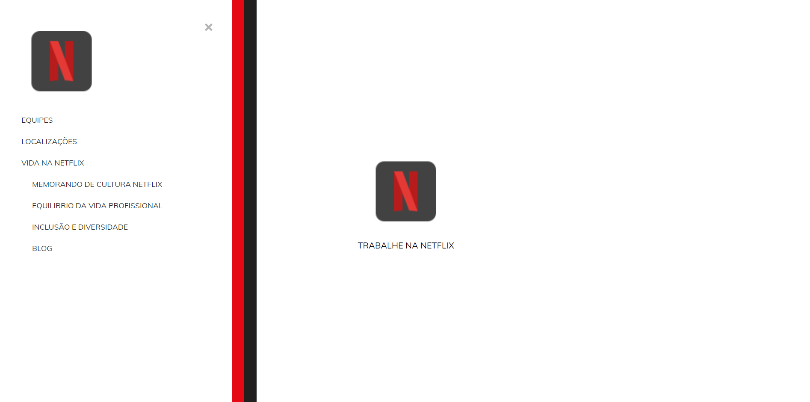

> Projeto criado da Netflix Móvel

🔗  [Acesse aqui](https://prdsilva80.github.io/trabalhe-na-netflix/)

# 🛠️ Tecnologias

    

# 👨‍🎓 O que aprendi

- Fazer animações na página com CSS
- Usar o Icons8.com para puxar as imagens
- Corrigir problemas no código do JS

# 📧 Contato

- probertos717@gmail.com